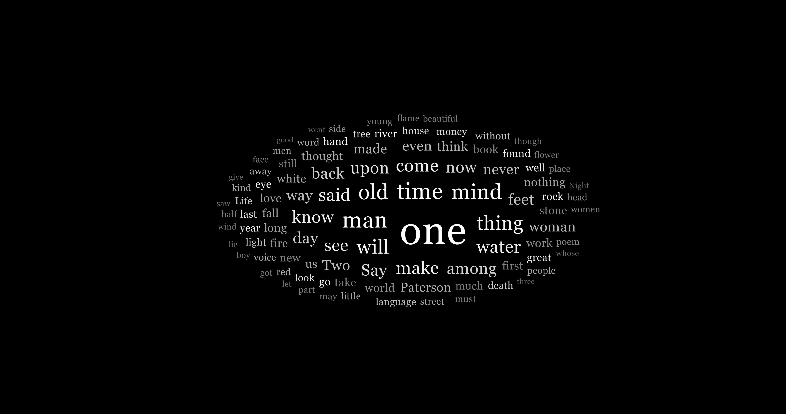
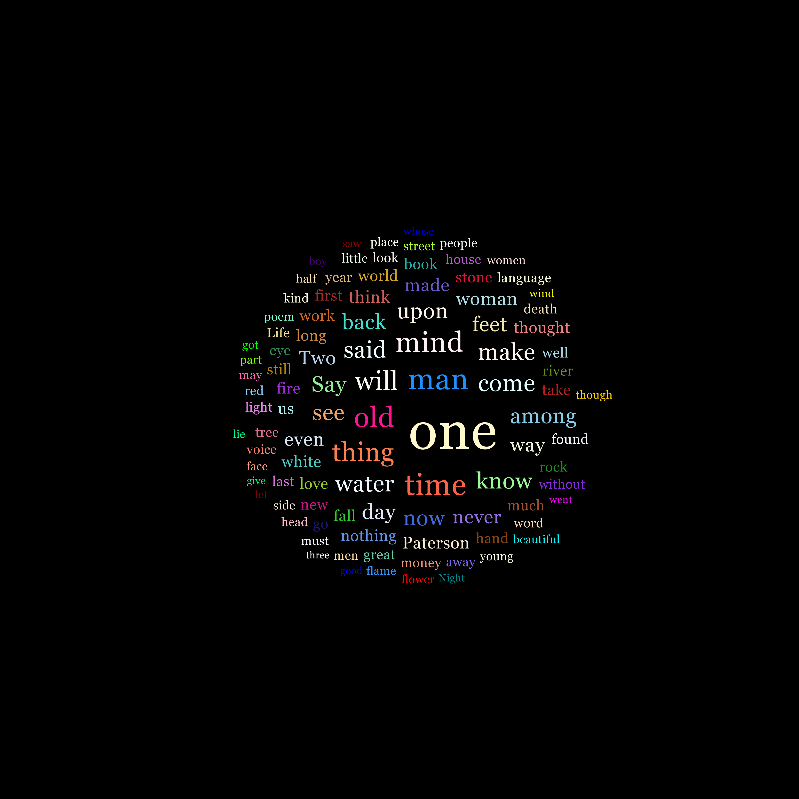
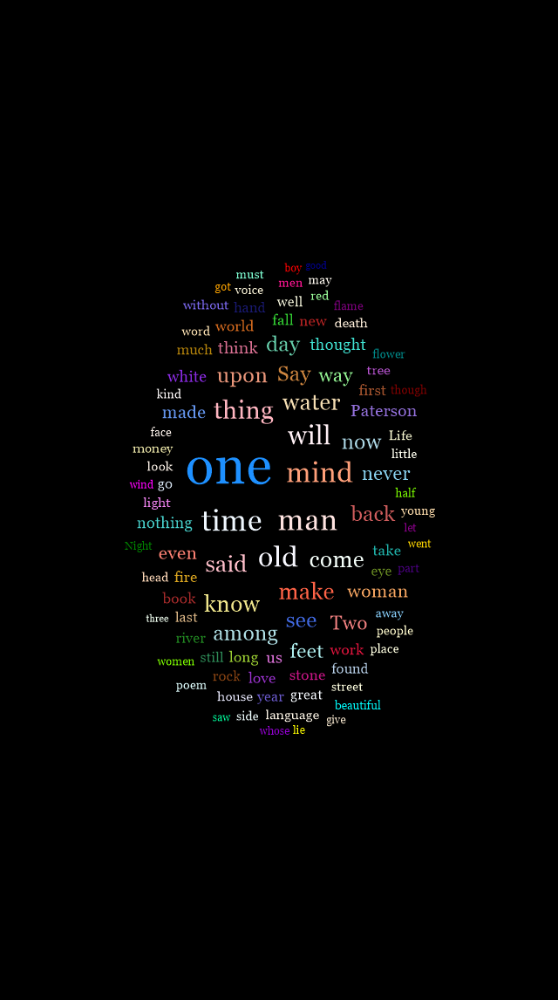
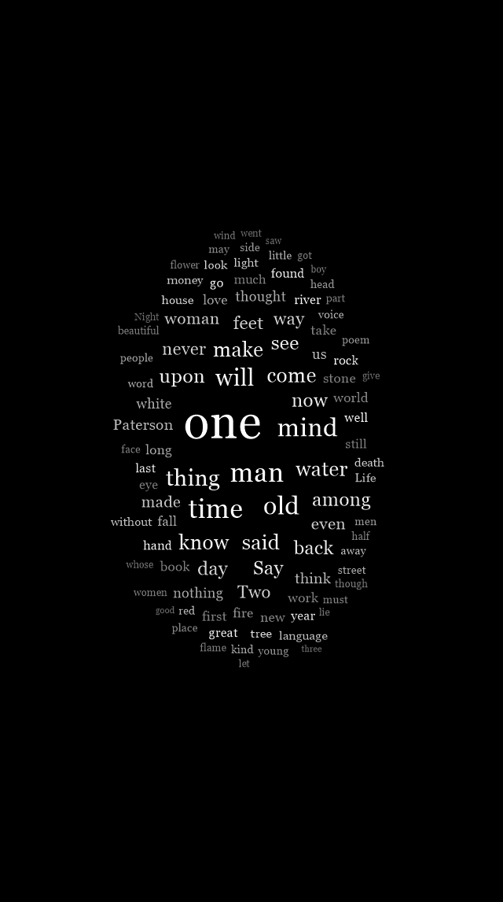

# PSWordCloud

Create pretty word clouds with PowerShell!

## Installation

```powershell
Install-Module PSWordCloud
```

## Usage

```powershell
Get-ClipBoard | New-WordCloud -Path .\wordcloud.png -FontFamily Georgia

Get-Content .\words.txt | New-WordCloud -Path .\wordcloud2.png -ImageSize 1080p

Get-ClipBoard | New-WordCloud -Path .\wordcloud3.png -FontFamily Consolas -ImageSize 1000x1000
```

## Examples

Using the poem _Paterson_ by William Carlos Williams

### 4K 4096x2160 Resolution (Default)


### 4K 4096x2160 Resolution (Monochrome)



### 4K 4096x4096 Resolution (Default)



### Mobile Format 640x1146 (Default)



### Mobile Format 640x1146 (Monochrome)


